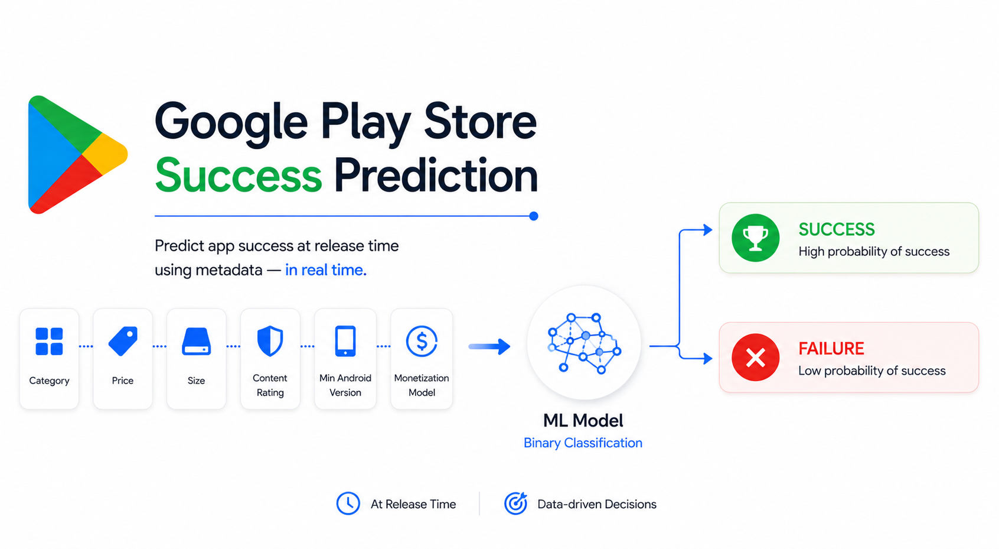

# Google Play Store Success Prediction

Predict whether a mobile app will become a **"success"** — measured by
adoption, engagement, or editorial recognition — using only metadata
available at (or near) release time: category, price, size, content
rating, minimum Android version, and monetization model.

[](https://github.com/<user>/play-store-success-prediction/actions/workflows/ci.yml)

## Problem framing

Binary classification. An app is labeled `Success` if it reached **any**
of:

* installs in the top quantile (adoption),
* rating count in the top quantile (engagement), or
* Google Play **Editors' Choice** (editorial recognition).

Everything else is `Failure`. See [`src/playstore/target.py`](src/playstore/target.py)
for the exact logic and the leakage rationale below.

## Results

Generated by `python -m playstore.train` and written to
[`artifacts/metrics.json`](artifacts/metrics.json) — regenerate with the
command below rather than trusting numbers pasted into a README that can
drift out of date.

<!-- RESULTS_TABLE_START -->
Run: `python -m playstore.train --sample-frac 0.12 --cv-folds 4 --tuning-iterations 12`
(222,042 train / 55,511 test rows — a 12% subsample of the ~2.3M-row dataset;
see [Known limitations](#known-limitations)).

**Cross-validated model comparison** (training set, 4-fold):

| Model | Accuracy | Precision | Recall | F1 | ROC-AUC |
|---|---|---|---|---|---|
| **LightGBM** | 0.681 | 0.403 | 0.607 | **0.484** | 0.718 |
| Random Forest | 0.636 | 0.372 | 0.690 | 0.483 | 0.717 |
| Gradient Boosting | 0.678 | 0.400 | 0.609 | 0.483 | 0.717 |
| Logistic Regression | 0.644 | 0.373 | 0.652 | 0.475 | 0.698 |

LightGBM was selected, tuned (`RandomizedSearchCV`, 12 iterations), and
evaluated once on the held-out test set:

| Threshold | Accuracy | Precision | Recall | F1 | ROC-AUC |
|---|---|---|---|---|---|
| 0.50 (default) | 0.659 | 0.391 | 0.653 | 0.489 | 0.719 |
| 0.48 (chosen from train OOF) | 0.645 | 0.382 | 0.683 | 0.490 | 0.719 |

These numbers are modest, and deliberately so relative to the archived
reports in `docs/legacy/` (which claimed ~87% ROC-AUC): those numbers were
never reproducible from any real run (see `docs/legacy/README.md`), and were
almost certainly also inflated by leakage (`Editors Choice`, install/rating
counts) that this version's feature set explicitly excludes. A ~0.72 ROC-AUC
predicting future success from *release-time metadata alone* — category,
price, size, content rating, Android version, monetization flags, with no
signal about how users actually respond to the app — is a plausible, honest
ceiling for this feature set. The top features by importance are `size_mb`
and `android_version`, not an installs/ratings proxy, which is exactly what
a leakage-free model on this feature set should look like.
<!-- RESULTS_TABLE_END -->

| | |
|---|---|
| Confusion matrix |  |
| ROC curve |  |

The full set of evaluation plots (precision-recall curve, feature
importance, threshold sweep, model comparison) is still generated by every
training run — see `reports/figures/` after running the pipeline.

## Getting the data

The raw export (`Google-Playstore.csv`, ~650 MB, ~2.3M rows) is **not**
committed to this repository — see [`.gitignore`](.gitignore). Download the
"Google Play Store Apps" dataset (Kaggle, `gauthamp10/google-playstore-apps`
— verify against the source you originally obtained it from) and place it
at:

```
data/raw/Google-Playstore.csv
```

## Setup

```bash
python -m venv .venv
source .venv/bin/activate   # .venv\Scripts\activate on Windows
pip install -e .
pip install -r requirements-dev.txt
```

## Reproducing the pipeline

```bash
# Full dataset, full search (slow: tens of minutes on a laptop)
python -m playstore.train

# Fast iteration: small subsample, short hyperparameter search
python -m playstore.train --sample-frac 0.1 --cv-folds 3 --tuning-iterations 10
```

This single command performs the entire pipeline described below and
writes the fitted pipeline, metrics, and every figure in this README to
`artifacts/` and `reports/figures/`.

```bash
pytest             # unit + smoke tests (synthetic data, runs in seconds)
ruff check src tests
mypy src
```

## Methodology

```
raw CSV
  -> train/test split (80/20, stratified is not possible pre-label; split first)
  -> success-label thresholds FIT ON TRAIN ONLY, applied to both splits
  -> feature pipeline (fit on train, applied to test):
       SizeParser              "10M"/"512k"/"1.2G" -> size_mb
       AndroidVersionExtractor "5.0 and up"        -> android_version
       BooleanInteractionFeatures                  -> free_with_ads, paid_with_iap
       ColumnTransformer:
         numeric     -> median impute -> standard scale
         categorical -> constant-impute "Unknown" -> one-hot (unknown categories ignored)
         boolean     -> cast to int -> most-frequent impute
  -> cross-validated comparison of 4 candidate models (accuracy, precision,
     recall, F1, ROC-AUC, average precision -- all 6, actually computed)
  -> RandomizedSearchCV tuning of the best model
  -> SMOTE oversampling, wired into the pipeline so it only ever touches
     training folds, never validation/test rows
  -> decision threshold chosen from out-of-fold TRAIN predictions
  -> single evaluation pass on the held-out test set
```

### Why the label thresholds are fit on the training split only

The "success" thresholds (e.g. "top 20% of installs") are statistics
computed from data, exactly like the mean a `StandardScaler` learns.
Computing them from the full dataset before splitting — as an earlier
version of this project did — lets information about which apps end up in
the test set influence how *every* row's label is defined. Fitting the
thresholds on the training split and reusing the fixed numbers on the test
split keeps the test set genuinely unseen.

### Why `Editors Choice`, `Rating`, and `Installs` are not features

`Editors Choice` is one of the three conditions that *define* the label; a
model that gets to see it as an input has been handed the answer. `Rating`
and `Installs`/`Rating Count` only exist after an app has been live long
enough to accumulate them, so a model meant to score an app **before**
launch can't rely on them either. The feature set is deliberately
restricted to what's known at submission time: category, price, size,
minimum Android version, content rating, and the monetization flags.

### Why SMOTE is wired in via `imblearn.pipeline.Pipeline`

`imbalanced-learn`'s pipeline only resamples data flowing through `fit` —
`predict`/`predict_proba` always skip the resampling step. A plain
`sklearn.pipeline.Pipeline` has no concept of resampling at all, so if you
oversample once, up front, and cross-validate afterward, synthetic
neighbours of validation-fold points leak into the training folds. Wrapping
everything (preprocessing, SMOTE, classifier) in one `imblearn` pipeline
and only ever calling `cross_validate`/`cross_val_predict` on the whole
thing keeps that from happening.

### Why the decision threshold is picked from out-of-fold predictions, not the test set

Scanning thresholds against the test set and reporting the best one (as an
earlier version of this project did) quietly fits a parameter to the same
data used to report "final" performance — the reported numbers stop being
an honest estimate of generalization. Here, the threshold is chosen from
`cross_val_predict` output on the training set; the test set is touched
exactly once, after the threshold is already fixed.

## Project structure

```
├── src/playstore/        # the actual pipeline (importable, tested)
│   ├── config.py          # paths, column names, hyperparameter defaults
│   ├── data.py             # CSV loading, Size/Android-version parsing
│   ├── target.py           # leakage-safe success-label definition
│   ├── features.py         # custom transformers + preprocessing pipeline
│   ├── modeling.py         # candidate models, SMOTE wiring, search spaces
│   ├── evaluate.py         # CV comparison, tuning, threshold selection
│   ├── visualization.py    # consistent plotting for every figure above
│   └── train.py            # CLI entry point tying it all together
├── tests/                # pytest: transformers, label logic, e2e smoke test
├── notebooks/01_eda.ipynb # exploration; calls into src/playstore, no duplicated logic
├── data/raw/              # gitignored -- put Google-Playstore.csv here
├── artifacts/             # gitignored -- model_pipeline.joblib, metrics.json
├── reports/figures/       # gitignored -- PNGs referenced by this README
├── assets/                # tracked -- static images (e.g. README header)
└── docs/legacy/           # earlier project write-ups, kept for history only
                            # (their numbers don't match any real run -- see
                            # docs/legacy/README.md)
```

## Known limitations

* **Selection bias**: the dataset only contains apps that existed at
  scrape time; apps removed from the store before scraping are invisible
  to it.
* **No temporal modeling**: success is evaluated at a single snapshot, not
  as a trajectory.
* **No text/NLP features**: app name and description are unused.
* **Tractability subsampling**: `--sample-frac` exists because a full run
  over ~2.3M rows with a wide hyperparameter search is a multi-hour job on
  a laptop; the numbers in this README were generated with a reduced
  sample and search budget (see `artifacts/metrics.json` for the exact
  configuration used) and should be treated as a demonstration of the
  methodology, not a claim about the ceiling of this approach on the full
  dataset.

## License

[MIT](LICENSE)
